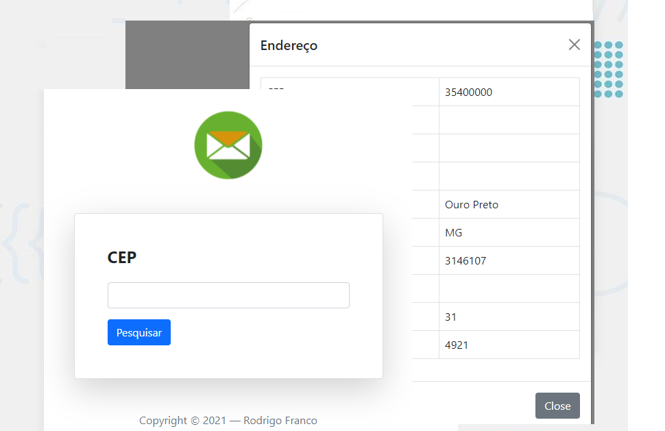

<h1 align="center">
  :mortar_board: CEP :mortar_board:
</h1>

<a href="#-projeto">Resumo</a>&nbsp;&nbsp;&nbsp;|&nbsp;&nbsp;&nbsp;  
  <a href="#-layout">Contato</a>&nbsp;&nbsp;&nbsp;|&nbsp;&nbsp;&nbsp;

 

## 💻 Resumo

Repositório do projeto de um site que tem objetivo de procurar o endereço através do CEP.

Nesse projeto usei HTML, CSS, PHP, Javascript e Bootstrap.

O resultado final do site pode ser conferido clicando [aqui](https://rrodrigofranco.000webhostapp.com/).

Obs.: O banco de dados equivalente a esse projeto está no arquivo cep.zip.

## :telephone: Contato

Para mais trabalhos acesse meu [LinkedIn](https://www.linkedin.com/in/rodrigo-ribeiro-franco-862884127/) e outros repositórios aqui no GitHub. 

Meu e-mail: francorodrigognr@yahoo.com.br

Número de telefone: (31) 998755-5101

